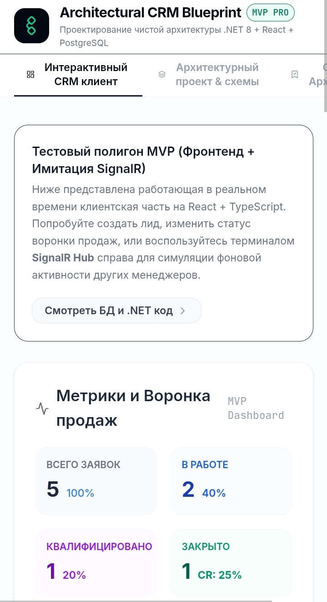
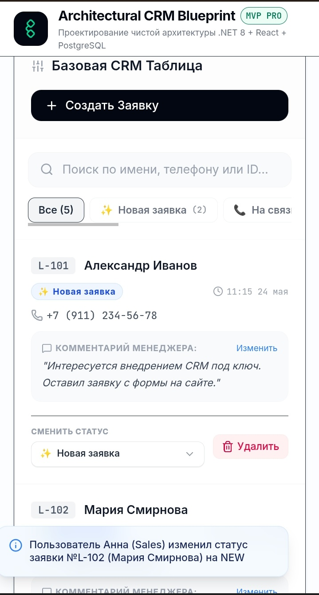
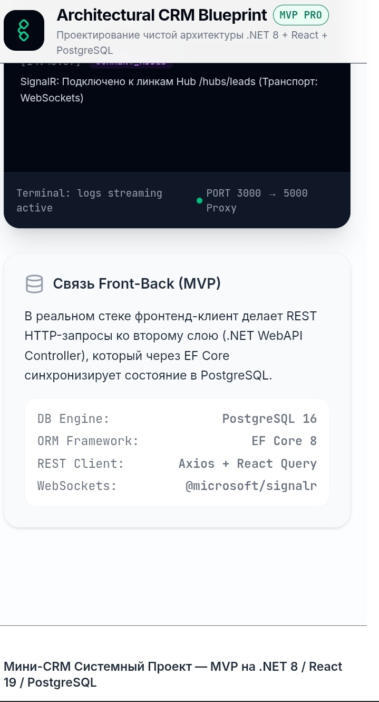
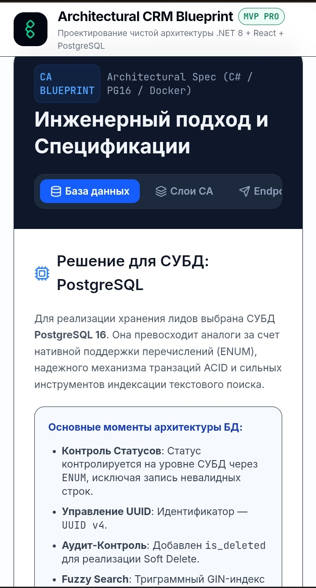
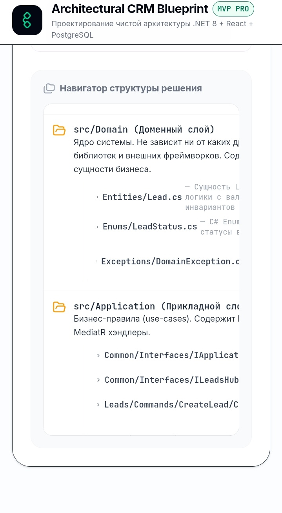

# Mini-CRM Architectural MVP

Интерактивный архитектурный прототип клиент-серверной микро-CRM системы на базе .NET 8 (Clean Architecture, CQRS, MediatR), PostgreSQL 16 и React 19 с поддержкой real-time событий через SignalR.

## Technical Stack

### Backend (.NET Core)
*   **Платформа:** .NET 8 SDK
*   **Архитектура:** Clean Architecture, разделение CQRS (Command Query Responsibility Segregation)
*   **Управление потоками и Use-Cases:** MediatR (внутрислойный диспетчер)
*   **ORM / Слой данных:** Entity Framework Core 8 + PostgreSQL Database Provider
*   **Валидация:** FluentValidation (изолированные классы бизнес-правил)
*   **Спецификации real-time:** ASP.NET Core SignalR Core

### Frontend (SPA Client)
*   **Фреймворк:** React 19 + TypeScript (модульная структура компонентов)
*   **Сборщик:** Vite 6
*   **Стилизация:** Tailwind CSS 4 (дизайнерский UI без сторонних тяжелых библиотек компонентов)
*   **Анимации:** Motion (плавный рендеринг переходов)
*   **Иконки:** Lucide React

### СУБД & Инфраструктура
*   **Главная СУБД:** PostgreSQL 16 (с расширением `pg_trgm` для быстрого текстового поиска)
*   **Контейнеризация:** Docker (мультиэтапный Dockerfile для WebAPI) + Docker Compose (оркестрация приложения и PostgreSQL)

---

## Architectural Decisions

### 1. Почему Clean Architecture оправдана на этапе MVP?
Применение Clean Architecture в самом начале разработки компенсирует риски быстрого роста кодовой базы за счет следующих преимуществ:
*   **Слабая зацепленность (Loose Coupling):** Доменная логика (`src/Domain`) полностью независима от деталей реализации — баз данных, библиотек UI, брокеров сообщений и веб-фреймворков. При необходимости миграции с Postgres на другую СУБД изменятся только классы инфраструктуры (`src/Infrastructure`).
*   **Выделенный прикладной уровень (`src/Application`):** Все сквозные сценарии использования (Use-Cases) инкапсулированы внутри MediatR Command/Query хэндлеров. Это упрощает написание модульных (Unit) и интеграционных тестов с изоляцией от внешних зависимостей.
*   **Чистая валидация:** Замена встроенных атрибутов `[Required, Phone]` над DTO (Data Annotations) на независимые валидаторы FluentValidation позволяет вынести логику валидации инвариантов бизнес-моделей в прикладной слой, сохраняя контроллеры чистыми от условной логики.

### 2. Использование возможностей PostgreSQL для производительности
Архитектурный проект СУБД спроектирован с учетом производительности при интенсивных продажах:
*   **Идентификаторы (UUID v4):** PK полей используют тип `UUID`, генерируемый на стороне БД с помощью `uuid-ossp`. Это защищает систему от перебора идентификаторов внешними пользователями (ID-enumeration attacks) и упрощает распределенную генерацию записей (например, при оффлайн-сохранении на фронтенде).
*   **ENUM типы:** Поле `status` типизировано через нативный перечисление `lead_status` PostgreSQL. Это гарантирует неизменяемость и жесткое соблюдение схемы данных со стороны СУБД, повышая консистентность.
*   **Текстовый GIN-индекс:** Поиск лидов по имени клиента оптимизирован с помощью триграммного индекса GIN (расширение `pg_trgm`). В отличие от оператора `LIKE '%val%'`, который при наличии `%` в начале игнорирует B-Tree индексы, GIN-индекс обеспечивает быстрый нечеткий текстовый поиск с константным временем выполнения даже при миллионах записей.
*   **Индексация неактивных данных:** Обычные индексы для выборки создаются с фильтрацией `WHERE is_deleted = FALSE`, что позволяет значительно уменьшить объём дискового пространства за счёт исключения архивированных (мягко удалённых) лидов.

*   ### Скриншоты интерфейса

<table>
  <tr>
    <td align="center">
      
      <br>Описание первого скрина
    </td>
    <td align="center">
      
      <br>Описание второго скрина
    </td>
  </tr>
  <tr>
    <td align="center">
      
      <br>Описание третьего скрина
    </td>
    <td align="center">
      
      <br>Описание четвертого скрина
    </td>
  </tr>
  <tr>
    <td align="center" colspan="2">
      
      <br>Пятый скрин (по центру)
    </td>
  </tr>
</table>


---

## Getting Started

Запустите инфраструктуру и приложение в 3 шага с помощью **Docker Compose**:

### Шаг 1: Клонирование репозитория и проверка окружения
Убедитесь, что у вас установлены `Docker` и `Docker Compose`. Проверьте конфигурацию переменных окружения в корневом файле `.env.example`.
cp .env.example .env

### Шаг 2: Сборка и запуск контейнеров
Запустите сборку веб-API и развертывание контейнеров базы данных одной командой из корня проекта:
```bash
docker-compose up --build -d
```
Эта команда поднимет изолированную сеть:
1.  Контейнер `minicrm_postgres_db` (PostgreSQL 16) на порту `5432`.
2.  Контейнер веб-сервера `minicrm_dotnet_api` (.NET 8 SDK / WebAPI) на порту `5000` (клиентские запросы проксируются сервером).

### Шаг 3: Проверка доступности
После успешного старта доступны следующие ресурсы приложения:
*   **REST API Swagger UI:** `http://localhost:5000/swagger`
*   **Веб-интерфейс CRM (React):** `http://localhost:3000`

---

## API & Real-time Contracts

### REST API Эндпоинты (`LeadsController`)
*   `GET /api/leads` — Сводный список лидов с постраничным разбиением (пагинация), нечетким поиском по `name` и фильтрацией по этапу воронки `status`.
*   `POST /api/leads` — Регистрация нового лида с входящей валидацией телефона и имени клиента.
*   `PATCH /api/leads/{id}/status` — Перевод лида на другой этап (Status Change) с инициированием броадкастинга в WebSocket.
*   `PUT /api/leads/{id}` — Полное обновление информации о лиде (корректировка примечаний, контактных данных).
*   `DELETE /api/leads/{id}` — Мягкое удаление из операционной СУБД (`Soft Delete`).

### Real-time события (`LeadsHub`)
При изменении состояния конвейера продаж по сокету всем авторизованным менеджерам рассылаются события:
*   `ReceiveLeadCreated` — Уведомление о регистрации нового лида через внешние интеграции или формы.
*   `ReceiveLeadStatusChanged` — Моментальное перемещение карточки лида по воронке на UI других менеджеров.
*   `ReceiveLeadCommentUpdated` — Обновление заметок по сделке в живом режиме без перезагрузки страницы.
*   `ReceiveLeadDeleted` — Синхронное скрытие удаленного лида из табличного представления.

---

## Future Roadmap

Для вывода MVP в промышленную эксплуатацию (Production-Ready) запланированы следующие улучшения:
1.  **Распределенное кэширование (Redis):** Настройка гибридного кэширования для чтения востребованного списка лидов с оперативным сбросом (Cache Invalidation) при транзакциях на запись.
2.  **Аутентификация & Авторизация:** Интеграция IdentityServer (ASP.NET Core Identity + Duende Server) для защиты API с помощью Bearer JWT (Access/Refresh токенов) и разграничение прав (RBAC-модель доступа: Sales, Finance, Lead Architect).
3.  **Аудит-Логирование (Audit Logging + Envers):** Подключение механизма хранения истории изменения каждого поля лида во вспомогательной таблице `leads_history` для детального разбора инцидентов и KPI менеджеров.
4.  **Фоновый процессинг (Hangfire):** Интеграция планировщика для асинхронного выполнения фоновых задач (отправка писем, формирование отчетов, обогащение контактных данных из внешних баз).

